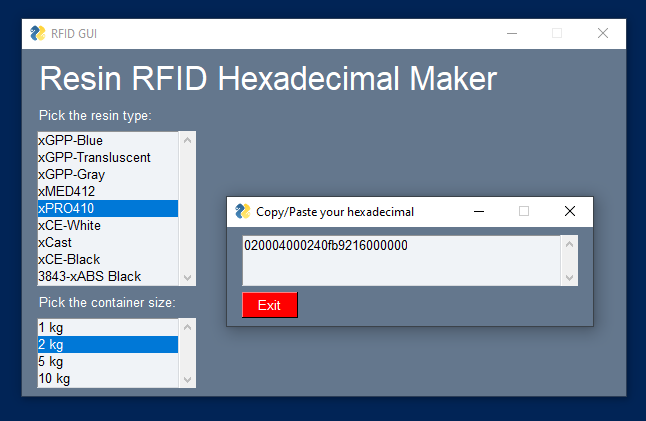
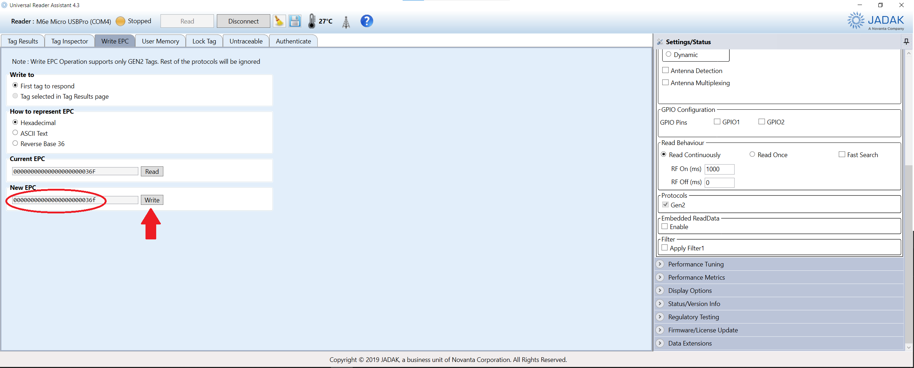

# RFIDTag_Generator
This is a simple GUI for generating unique RFID hexadecimal codes based on a given 3D printing resin, color, and container size.

An operator selects the resin and container, and this program outputs a hexadecimal code:

After this code is generated, the operator copies and pastes it to a different program that writes on the RFID tags:

